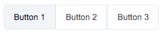

# ButtonGroup

## Examples



```html
<script>
   import { ButtonGroup, ButtonGroupItem } from '@sveltinio/essentials';
   function handleMessage(event) {
      console.log(event.detail);
   }
</script>

<ButtonGroup>
    <ButtonGroupItem id="1" on:click={handleMessage}>Button 1</ButtonGroupItem>
    <ButtonGroupItem id="2" on:click={handleMessage}>Button 2</ButtonGroupItem>
    <ButtonGroupItem id="3" on:click={handleMessage}>Button 3</ButtonGroupItem>
</ButtonGroup>
```

## Properties

The `ButtonGroup` component is the main wrapper component and exposes the following set of properties.

### Functionals

| Property     | Type   | Required | Default      | Description                                                  |
| :----------- | :----: | :------: | :----------: |:------------------------------------------------------------ |
| activeButton | string |    no    | empty string | show/hide the items                                          |
| size         | string |    no    | `base`       | Set the label size. One of: [`xs`, `sm`, `base`, `md`, `lg`] |

### Styles

| Property |  Type   | Required |   Default   | Description                                       |
| :------- | :-----: | :------: | :---------: | :------------------------------------------------ |
| class    | string  |    no    |             | The css class name used to make a theme variant   |
| styles   | Object  |    no    |     `{}`    | Used to pass CSS variables to apply custom styles |

Refer to the [Theming](#theming) section to learn how those props work and and how to use them.

## Theming

To simplify custom styles on the component we used the built-in solution for component theming using [style-props].

The two component properties `styles` and `class` are the ones allowing you to customize the component appearence.

Read more [here](./THEMING.md)

<!-- Resources -->
[style-props]: https://svelte.dev/docs#template-syntax-component-directives---style-props
