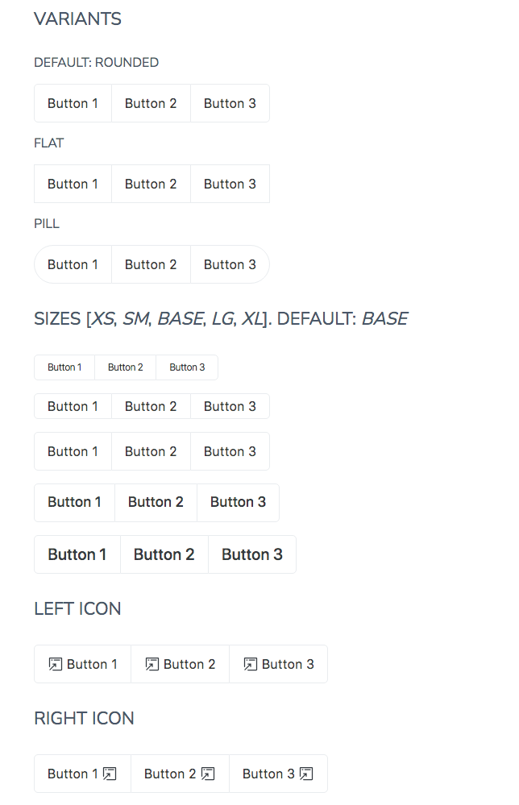

# ButtonGroup

The `ButtonGroup` is an accessible widget as a container for grouping a set of buttons where buttons implement the [WAI-ARIA Button Pattern].

## Examples



## Usage

```html
<script>
   import { ButtonGroup } from '@sveltinio/essentials/button-group';
   function handleMessage(event) {
      console.log(event.detail.eventDetails);
   }
</script>

<ButtonGroup>
   <ButtonGroup.Button id="1" label="Button 1" on:click={handleMessage} />
   <ButtonGroup.Button id="2" label="Button 2" on:click={handleMessage} />
   <ButtonGroup.Button id="3" label="Button 3" on:click={handleMessage} />
</ButtonGroup>
```

## Properties

### Functionals

#### ButtonGroup

| Property     | Type      | Required | Default   | Description                                                                  |
| :----------- | :-------: | :------: | :-------: |:---------------------------------------------------------------------------- |
| activeButton | `string`  |    no    |           | Set the active button                                                        |
| size         | `string`  |    no    | `base`    | Set the label size. One of: `['xs', 'sm', 'base', 'lg', 'xl']`               |
| shape        | `string`  |    no    | `rounded` | Set the button shape. One of `['rounded', 'pills', 'flat']`                  |
| responsive   | `boolean` |    no    | `false`   | If true, vertical on small screen and horizontal on medium and large screens |

#### ButtonGroupItem

| Property | Type     | Required | Default     | Description                                      |
| :------- | :------: | :------: | :---------: |:------------------------------------------------ |
| id       | `string` |   yes    |             | An unique identifier for the button              |
| label    | `string` |   yes    |             | Set the label for the button                     |
| icon     | `any`    |    no    | `undefined` |                                                  |
| position | `string` |    no    | `left`      | Set the icon position. One of: [`left`, `right`] |

### Styles

#### ButtonGroup

| Property |  Type     | Required | Default | Description                                       |
| :------- | :-------: | :------: | :-----: | :------------------------------------------------ |
| class    | `string`  |    no    |         | The css class name used to make a theme variant   |
| styles   | `object`  |    no    | `{}`    | Used to pass CSS variables to apply custom styles |

Refer to the [Theming](#theming) section to learn how those props work and and how to use them.

## Slots

### ButtonGroup

| Name | Default | Fallback | Description                 |
| :--- | :-----: | :------: | :-------------------------- |
|      | ✓       |    ✗     | `ButtonGroupItem` component |

## Events

### ButtonGroupItem

| Name            |  Type      |
| :-------------- | :--------: |
| `on:click`      | dispatched |
| `on:change`     | forwarded  |
| `on:keyup`      | forwarded  |
| `on:keydown`    | forwarded  |
| `on:mouseenter` | forwarded  |
| `on:mouseleave` | forwarded  |

## Keyboard Interaction

See the [Keyboard Interaction] section for the [WAI-ARIA Button Pattern].

## Theming

To simplify custom styles on the component we used the built-in solution for component theming using [style-props].

The two component properties `styles` and `class` are the ones allowing you to customize the component appearence.

Read more [here](./THEMING.md)

<!-- Resources -->
[WAI-ARIA Button Pattern]: https://www.w3.org/WAI/ARIA/apg/patterns/button/
[Keyboard Interaction]: https://www.w3.org/WAI/ARIA/apg/patterns/button/#keyboardinteraction
[style-props]: https://svelte.dev/docs#template-syntax-component-directives---style-props
