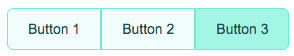
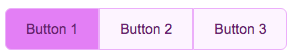

# ButtonGroup - Theming

To simplify custom styles on the component we used the built-in solution for component theming using [style-props].

The two component properties `styles` and `theme` are the ones allowing you to customize the component appearence.

- `class`: is a global CSS class name where the class content has the CSS variables to override. Using `class` is more suitable when the goal is to create personal versions(themes) for the component, so sevaral props are override;
- `styles` is a JS object with the CSS variable name to override (without `--` prefix) as key and the value set to the allowed one for that CSS variable. This approach helps when you wish to tune few styles for the component.

> Refer to the [Design Rules] document to better understand how the component has been designed and how to customize the styles.

## CSS Variables

The CSS variables are defined in the [variables.css](./variables.css) file.

## Example

### Custom Styles with prop



```html
<script>
   import { ButtonGroup, ButtonGroupItem } from '@sveltinio/essentials';

   function handleMessage(event: CustomEvent) {
      console.log(event.detail);
   }

   const myBtnGroupStyles = {
      color: '#134e4a',
      pl: '1.25rem',
      pr: '1.25rem',
      'bg-color': '#f0fdfa',
      'bg-color-hover': '#99f6e4',
      'border-color': '#5eead4',
      'active-color': '#134e4a',
      'active-bg-color': '#2dd4bf',
      'active-border-color': '#5eead4'
   }
</script>

<ButtonGroup styles={myBtnGroupStyles}>
    <ButtonGroupItem id="1" on:click={handleMessage}>Button 1</ButtonGroupItem>
    <ButtonGroupItem id="2" on:click={handleMessage}>Button 2</ButtonGroupItem>
    <ButtonGroupItem id="3" on:click={handleMessage}>Button 3</ButtonGroupItem>
</ButtonGroup>
```

### Custom Styles with CSS Class



```css
/* app.css*/
.my-btngroup {
  --color: #701a75;
  --pl: 1.25rem;
  --pr: 1.25rem;
  --bg-color: #fdf4ff;
  --bg-color-hover: #f5d0fe;
  --border-color: #f0abfc;
  --active-color: #701a75;
  --active-bg-color: #e879f9;
  --active-border-color: #f0abfc;
}
```

```html
<script>
   import { ButtonGroup, ButtonGroupItem } from '@sveltinio/essentials';
</script>

<ButtonGroup class="my-btngroup">
    <ButtonGroupItem id="1" on:click={handleMessage}>Button 1</ButtonGroupItem>
    <ButtonGroupItem id="2" on:click={handleMessage}>Button 2</ButtonGroupItem>
    <ButtonGroupItem id="3" on:click={handleMessage}>Button 3</ButtonGroupItem>
</ButtonGroup>
```

<!-- Resources -->
[style-props]: https://svelte.dev/docs#template-syntax-component-directives---style-props
[Design Rules]: https://github.com/sveltinio/components-library/blob/main/docs/design-rules.md
