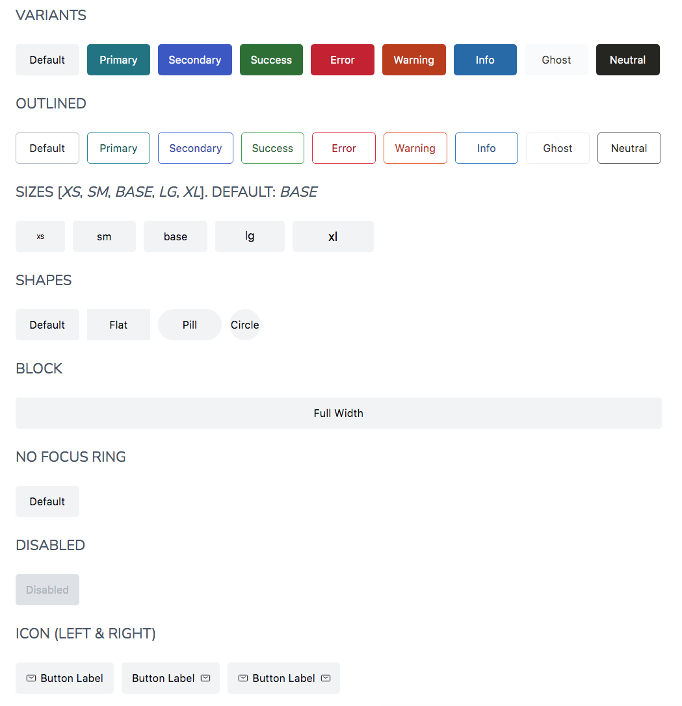

# Button

The `Button` is an interactive and accessible Svelte component implementing the [WAI-ARIA Button Pattern] and enabling users to trigger an action. It can be a pure `button` or a link `a`.

It supports different:

- **variants**: `default`, `primary`, `secondary`, `info`, `error`, `success`, `warning`, `ghost` and `neutral`
- **sizes**: `xs`, `sm`, `base` (default), `lg` and `xl`
- **styles**: filled (default), `outlined`
- **shapes**: `rounded` (default), `pills`, `circle` and `flat`
- **focus**: with or without the focus ring
- **icons**: to render an Icon either on the left side or the right side.

## Examples



## Usage

```html
<script>
   import { Button } from '@sveltinio/essentials/button'
   import { MailIcon } from '@indaco/svelte-iconoir/main';
   import { PlusIcon } from '@indaco/svelte-iconoir/plus';

   const handleButtonClick = (event) => {
      alert('button clicked on:' + event.detail.eventDetails);
   };
</script>

<Button variant="primary" on:click="{handleButtonClick}" />
<Button label="Click Me" variant="secondary" border="dashed" />
<Button label="Click Me" outlined />
<Button label="Click Me" variant="success" shape="flat" />
<Button variant="success"><MailIcon slot="leftIcon" /> Button Text</Button>
<Button variant="success"><MailIcon slot="rightIcon" /> Button Text</Button>
<Button variant="primary" size="lg" shape="circular">
   <PlusIcon />
</Button>
<Button href="https://sveltin.io">Link</Button>
<Button variant="secondary" href="#" prefetch="hover" />
```

## Properties

The `Button` component exposes a set of properties to allow its configuration.

### Functionals

| Property      |  Type     | Required | Default       | Description                                                                              |
| :------------ | :-------: | :------: | :-----------: | :--------------------------------------------------------------------------------------- |
| label         | `string`  |    no    | `undefined`   | Set the label for the button                                                             |
| alt           | `string`  |    no    | `label` value | Set the `aria-label` attribute                                                           |
| variant       | `string`  |    no    | `default`     | Button type (primary, secondary, error, success, ...)                                    |
| size          | `string`  |    no    | `base`        | Set the button size. One of `['xs', 'sm', 'base', 'lg' and 'xl']                         |
| border        | `string`  |    no    | `none`        | Set the border style. One of `['solid', 'dashed', 'dotted', ...]`                         |
| shape         | `string`  |    no    | `rounded`     | Set the button shape. One of `['rounded', 'pills', 'circle', 'flat']`                    |
| disabled      | `boolean` |    no    | `false`       | If true, the `button` is unusable and un-clickable. <br/>Set `aria-disabled` accordingly |
| outlined      | `boolean` |    no    | `false`       | White background button with the border                                                  |
| block         | `boolean` |    no    | `false`       | Will take the full width of the container                                                |
| noFocusRing   | `boolean` |    no    | `false`       | If true, no outline ring on focus                                                        |
| href          | `string`  |    no    |               | If set, the component renders an `a` alement and link's destination                      |
| prefetch      | `boolean` |    no    | `false`       | Enable data-sveltekit-prefetch for the link                                              |
| external      | `boolean` |    no    | `false`       | If true, opens the linked document in a new window or tab                                |

### Styles

| Property |  Type     | Required | Default | Description                                       |
| :------- | :-------: | :------: | :-----: | :------------------------------------------------ |
| class    | `string`  |    no    |         | The css class name used to make a theme variant   |
| styles   | `object`  |    no    |  `{}`   | Used to pass CSS variables to apply custom styles |

Refer to the [Theming](#theming) section to learn how those props work and and how to use them.

## Slots

| Name        | Default | Fallback | Description                                       |
| :---------- | :-----: | :------: | :------------------------------------------------ |
| `leftIcon`  | ✗       |    ✗     | The css class name used to make a theme variant   |
| `rightIcon` | ✗       |    ✗     | The css class name used to make a theme variant   |

## Events

| Name            |  Type     |
| :-------------- | :-------: |
| `on:click`      | forwarded |
| `on:change`     | forwarded |
| `on:keyup`      | forwarded |
| `on:keydown`    | forwarded |
| `on:mouseenter` | forwarded |
| `on:mouseleave` | forwarded |

## Keyboard Interaction

See the [Keyboard Interaction] section for the [WAI-ARIA Button Pattern].

## Theming

To simplify custom styles on the component we used the built-in solution for component theming using [style-props].

The two component properties `styles` and `class` are the ones allowing you to customize the component appearence.

Read more [here](./THEMING.md)

<!-- Resources -->
[WAI-ARIA Button Pattern]: https://www.w3.org/WAI/ARIA/apg/patterns/button/
[Keyboard Interaction]: https://www.w3.org/WAI/ARIA/apg/patterns/button/#keyboardinteraction
[style-props]: https://svelte.dev/docs#template-syntax-component-directives---style-props
