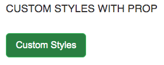
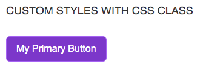

# Button - Theming

To simplify custom styles on the component we used the built-in solution for component theming using [style-props].

The two component properties `styles` and `class` are the ones allowing you to customize the component appearence.

- `styles` is a JS object with the CSS variable name to override (without `--` prefix) as key and the value set to the allowed one for that CSS variable. This approach helps when you wish to tune few styles for the component.
- `class`: is a global CSS class name where the class content has the CSS variables to override. Using `class` is more suitable when the goal is to create personal versions(themes) for the component, so sevaral props are override;

> Refer to the [Design Rules] document to better understand how the component has been designed and how to customize the styles.

## DOM Element Structure

The `Button` component is a `button` or a `a` HTML element. If an icon is present, the icon is placed in a `span` within the main HTML element

## CSS Variables

The CSS variables are defined in the [variables.css](../../styles/components/button/variables.css) file.

| Name | Default Value | Description |
| :----- | :--------------- | :------------- |
| min-w | `10ch` | |
| min-h | `44px` | |
| px    | `0.75rem` | |
| py    | `0.25rem` | |

## Examples

### Custom Styles with prop



```html
<script>
   import { Button } from '@sveltinio/essentials/button';

   const myStyles = {
      color: "rgb(54 83 20)",
      "border-color": "rgb(236 252 203)",
      "bg-color": "rgb(132 204 22)",
      "bg-hover": "rgb(163 230 53)",
      "outline-color": "rgb(190 242 100)",
      "outline-style": "dashed"
   }
</script>

<Button
   label="Custom Success"
   type="success"
   shape="rounded"
   withFocus
   styles={myStyles}
/>
```

### Custom Styles with CSS Class



```css
/* app.css*/
.my-primary-btn {
  --primary-color: white;
  --primary-bg-color: #7e22ce;
  --primary-border-color: #a855f7;
  --primary-bg-color-hover: #c026d3;
  --primary-outline-color: #d946ef;
}
```

```html
<script>
   import { Button } from '@sveltinio/essentials/button';
</script>

<Button label="My Primary Button" type="primary" shape="rounded" class="my-primary-btn" />
```

<!-- Resources -->
[style-props]: https://svelte.dev/docs#template-syntax-component-directives---style-props
[Design Rules]: https://github.com/sveltinio/components-library/blob/main/docs/design-rules.md
