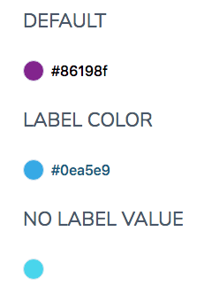

# ColorViewer

A simple utility component to render a colorful circle with the label set to the color value.

## Examples



## Usage

```html
<script>
   import { ColorViewer } from '@sveltinio/essentials/color';
<script>

<ColorViewer value="#FF5577" />
<ColorViewer value="#22d3ee" border showLabel={false} />
```

## Properties

The `ColorViewer` component exposes a set of properties but it does not prevent you to pass any additional props.

### Functionals

| Property   |  Type     | Required | Default | Description                                       |
| :--------- | :-------: | :------: | :------ | :------------------------------------------------ |
| value      | `string`  |    no    |         | Sets the emement's background color               |
| labelColor | `string`  |    no    |         | If false, hide the color value string             |
| showLabel  | `boolean` |    no    | `true`  | If false, hide the color value string             |
| size       | `integer` |    no    | `16`    | Size in pixels                                    |
| border     | `boolean` |    no    | `true`  | If true, sets the element's border                |

### Styles

| Property |  Type     | Required | Default | Description                                       |
| :------- | :-------: | :------: | :-----: | :------------------------------------------------ |
| class    | `string`  |    no    |         | The css class name used to make a theme variant   |
| styles   | `object`  |    no    | `{}`    | Used to pass CSS variables to apply custom styles |

Refer to the [Theming](#theming) section to learn how those props work and and how to use them.

## Theming

To simplify custom styles on the component we used the built-in solution for component theming using [style-props].

The two component properties `styles` and `class` are the ones allowing you to customize the component appearence.

Read more [here](./THEMING.md)

<!-- Resources -->
[style-props]: https://svelte.dev/docs#template-syntax-component-directives---style-props
