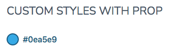

# Theming ColorViewer Component

To simplify custom styles on the component we used the built-in solution for component theming using [style-props].

The two component properties `styles` and `class` are the ones allowing you to customize the component appearence.

- `styles` is a JS object with the CSS variable name to override (**without** `--` as prefix) as key and the value set to the allowed one for that CSS variable. This approach helps when you wish to tune few styles for the component.
- `class`: is a global CSS class name where the class content has the CSS variables (**with** `--` as prefix) to override. Using `class` is more suitable if the goal is creating personal variants (themes) for the component.

> Refer to the [Design Rules] document to better understand how the component has been designed and how to customize the styles.

## Examples

### Custom Styles with prop



```html
<script>
   import { ColorViewer } from '@sveltinio/essentials/color';

   const myStyles = {
      'border-color': '#075985',
      'border-width': '2px',
      color: '#075985'
   };
</script>

<ColorViewer value="#0ea5e9" labelColor="#075985" border styles={myStyles} />
```

### Custom Styles with CSS Class

```css
/* app.css*/
.preview-color {
  --border-width: 2px;
  --border-color: #67e8f9;
}
```

```html
<script>
   import { ColorViewer } from '@sveltinio/essentials/color';
</script>

<ColorViewer value="#22d3ee" border class="preview-color" />
```

## DOM - CSS Variables Mapping Table

| Name             | Default     |
| :--------------- | :---------- |
| `gap`            | 0.5rem      |
| `cursor`         | pointer     |
| `font-family`    | system-ui, -apple-system, <br/>Segoe UI, Roboto, Ubuntu, <br/> Cantarell, Noto Sans, sans-serif; |
| `font-size`      | 1rem        |
| `font-weight`    | 400         |
| `line-height`    | 1.25        |
| `letter-spacing` | -0.05em     |
| `border-width`   | 1px         |
| `border-style`   | solid       |
| `border-color`   | transparent |

<!-- Resources -->
[style-props]: https://svelte.dev/docs#template-syntax-component-directives---style-props
[Design Rules]: https://github.com/sveltinio/components-library/blob/main/docs/design-rules.md
