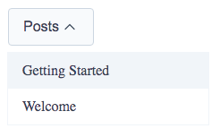

# Dropdown

`Dropdown` open a menu when the button is clicked. It is made by a combination of the `Dropdown`, `DropdownButton`, `DropdownContent`, and `DropdownItem` components.

## Examples



### **WITH ITEMS AS LINKS**

```html
<script>
   import {
      Dropdown,
      DropdownButton,
      DropdownContent
      DropdownItem
   } from '@sveltinio/essentials';
<script>

<Dropdown>
 <DropdownButton label="Menu" />
 <DropdownContent>
  <DropdownItem label="Item 1" href="#" />
  <DropdownItem label="Item 2" href="#" />
  <DropdownItem label="Item 3" href="#" />
 </DropdownContent>
</Dropdown>
```

## Properties

The Dropdown components set exposes a set of properties.

### Dropdown - Functionals

The `Dropdown` component is the main wrapper component.

| Property | Type     | Required | Default  | Description         |
| :------- | :------: | :------: | :------: |:------------------- |
| isOpen   | boolean  | no       |          | show/hide the items |

### Dropdown - Styles

| Property |  Type   | Required |   Default   | Description                                       |
| :------- | :-----: | :------: | :---------: | :------------------------------------------------ |
| class    | string  |    no    |             | The css class name used to make a theme variant   |
| styles   | Object  |    no    |     `{}`    | Used to pass CSS variables to apply custom styles |

Refer to the [Theming](#theming) section to learn how those props work and and how to use them.

### DropdownButton

The `DropdownButton` component exposes the following properties:

| Property | Type    | Required | Default  | Description       |
| :------- | :-----: | :------: | :------: |:----------------- |
| label    | string  | yes      |          | Button text       |
| iconSize | number  | no       | 20       | Set the icon size |

### DropdownContent

The `DropdownContent` component exposes the following properties:

| Property | Type    | Required | Default  | Description       |
| :------- | :-----: | :------: | :------: |:----------------- |
| absolute | boolean | no       | `false`  | Button text       |

### DropdownItem

The `DropdownItem` component exposes the following properties:

| Property | Type    | Required | Default  | Description                                 |
| :------- | :-----: | :------: | :------: |:------------------------------------------- |
| label    | string  | yes      |          | Item text                                   |
| mode     | string  | no       | `button` | Render as button or link                    |
| href     | string  | yes      |         | The URL of the page the link goes to        |
| prefetch | boolean | no       | `yes`    | Enable `data-sveltekit-preload-data`        |
| target   | string  | no       | `_self`  | Specifies where to open the linked document |

## Theming

To simplify custom styles on the component we used the built-in solution for component theming using [style-props].

The two component properties `styles` and `class` are the ones allowing you to customize the component appearence.

Read more [here](./THEMING.md)

<!-- Resources -->
[style-props]: https://svelte.dev/docs#template-syntax-component-directives---style-props
