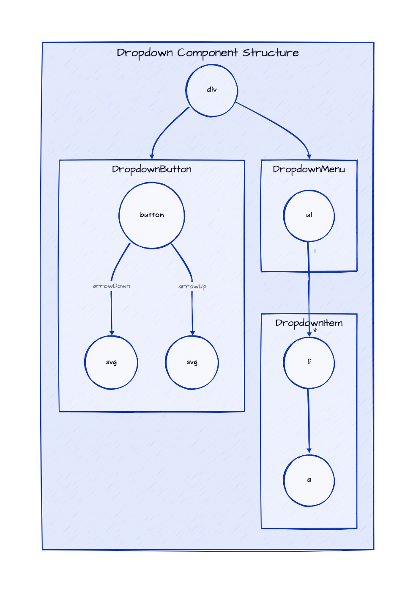
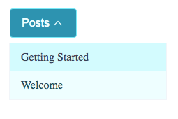

# Dropdown - Theming

To simplify custom styles on the component we used the built-in solution for component theming using [style-props].

The two component properties `styles` and `theme` are the ones allowing you to customize the component appearence.

- `styles` is a JS object with the CSS variable name to override (without `--` prefix) as key and the value set to the allowed one for that CSS variable. This approach helps when you wish to tune few styles for the component.
- `class`: is a global CSS class name where the class content has the CSS variables to override. Using `class` is more suitable when the goal is to create personal versions(themes) for the component, so sevaral props are override;

> Refer to the [Design Rules] document to better understand how the component has been designed and how to customize the styles.

## DOM Element Structure

Below is the DOM Element Structure for the `Dropdown` component.

> Legend
>
> - containers: Svelte components
> - circles: HTML elements



## Info Mapping Table

The DOM Element Structure above can be mapped to the following table going through the structure from top to bottom and from left to right.

| Component       | HTML Element & CSS Class Name | CSS Variables Prefix |
| :-------------- | ----------------------------: | -------------------: |
|                 | `div.sn-e-c-dropdown`         |                      |
| DropdownButton  | `btn`                         | `btn`                |
| DropdownContent | `list`                        | `list`               |
| DropdownItem    | `list__item`                  | `item`               |

## CSS Variables

The CSS variables are defined in the [variables.css](./variables.css) file.

## Examples



### Custom Styles with prop

```html
<script>
   import {
      Dropdown,
      DropdownButton,
      DropdownContent,
      DropdownItem
   } from '@sveltinio/essentials';

   const myStyles = {
      'btn-color': '#ecfeff',
      'btn-bg-color': '#0891b2',
      'btn-bg-color-hover': '#0e7490',
      'btn-border-color': '#67e8f9',
      'content-bg-color': '#ecfeff',
      'item-color': '#164e63',
      'item-bg-color-hover': '#cffafe'
   };
</script>

<Dropdown styles={myStyles}>
 <DropdownButton label="Menu" />
 <DropdownContent>
  <DropdownItem label="Item 1" href="#" />
  <DropdownItem label="Item 2" href="#" />
  <DropdownItem label="Item 3" href="#" />
 </DropdownContent>
</Dropdown>
```

### Custom Styles with CSS Class

```css
/* app.css*/
.my-dropdown {
  --btn-color: #ecfeff;
  --btn-bg-color: #0891b2;
  --btn-bg-color-hover: #0e7490;
  --btn-border-color: #67e8f9;
  --content-bg-color: #ecfeff;
  --item-color: #164e63;
  --item-bg-color-hover: #cffafe;
}
```

```html
<script>
   import {
      Dropdown,
      DropdownButton,
      DropdownContent,
      DropdownItem
   } from '@sveltinio/essentials';
</script>

<Dropdown class="my-dropdown">
 <DropdownButton label="Menu" />
 <DropdownContent>
  <DropdownItem label="Item 1" href="#" />
  <DropdownItem label="Item 2" href="#" />
  <DropdownItem label="Item 3" href="#" />
 </DropdownContent>
</Dropdown>
```

<!-- Resources -->
[style-props]: https://svelte.dev/docs#template-syntax-component-directives---style-props
[Design Rules]: https://github.com/sveltinio/components-library/blob/main/docs/design-rules.md
