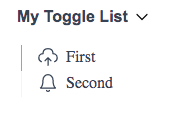
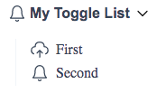

# ToggleList

The **ToggleList** component is used to includes a toggle list within the page. It supports different sizes for the title text:

- **sizes**: _xs_, _sm_, _base_, _md_, _lg_ (default) and _full_

## Examples



```html
<script lang="ts">
   import { ToggleList } from '@sveltinio/essentials';
   // Sample Icons
   import {
      LongArrowDownRightIcon,
      CloudUploadIcon,
      BellIcon
   } from '@indaco/svelte-iconoir';
   // sample data
   const contentForToggleList = [
      { label: 'First', url: '#first', icon: CloudUploadIcon },
      { label: 'Second', url: '#second', icon: BellIcon }
   ];
</script>

<h3>Default</h3>
<ToggleList title="My Toggle List" items={contentForToggleList} />

```



```html
<script lang="ts">
   import { ToggleList } from '@sveltinio/essentials';
   // Sample Icons
   import {
      LongArrowDownRightIcon,
      CloudUploadIcon,
      BellIcon
   } from '@indaco/svelte-iconoir';
   // sample data
   const contentForToggleList = [
      { label: 'First', url: '#first', icon: CloudUploadIcon },
      { label: 'Second', url: '#second', icon: BellIcon }
   ];
</script>

<h3>Custom Icon on the right side</h3>
<ToggleList title="My Toggle List" items={contentForToggleList}>
   <LongArrowDownRightIcon slot="rightSideIcon" />
</ToggleList>
```

## Properties

The `ToggleList` component exposes a set of properties but it does not prevent you to pass any additional props.

### Functionals

| Property  |  Type            | Required | Default | Description                                                                          |
| :-------- | :--------------: | :------: | :-----: | :----------------------------------------------------------------------------------- |
| title     | string           | yes      |         | The title for the List                                                               |
| items     | `Array<ListItem>`| yes      |         | An array of objects with `label`, `url` and `icon` props                             |
| full      | boolean          | no       | `false` | If true, the full size of the container is used. The icons will be placed at the end |

**items** is an array of _ListItem_ objects:

```typescript
export type ListItem = {
   label: string;
   url?: string;
   icon?: any;
};
```

### Styles

| Property |  Type   | Required |   Default   | Description                                       |
| :------- | :-----: | :------: | :---------: | :------------------------------------------------ |
| class    | string  |    no    |             | The css class name used to make a theme variant   |
| styles   | Object  |    no    |     `{}`    | Used to pass CSS variables to apply custom styles |

Refer to the [Theming](#theming) section to learn how those props work and and how to use them.

## Slots

Slots are used to replace the default icons (left and right sides).

<details><summary>Source Code</summary>

```html
<script lang="ts">
   import { ToggleList } from '@sveltinio/essentials';
   // Sample Icons
   import {
      LongArrowDownRightIcon,
      CloudUploadIcon,
      BellIcon
   } from '@indaco/svelte-iconoir';
   // sample data
   const contentForToggleList = [
      { label: 'First', url: '#first', icon: CloudUploadIcon },
      { label: 'Second', url: '#second', icon: BellIcon }
   ];
</script>

<h3>Left Side icon</h3>
<ToggleList title="My Toggle List" items={contentForToggleList}>
   <BellIcon size="18" slot="leftSideIcon" />
</ToggleList>

<h3>Custom Icons</h3>
<ToggleList title="My Toggle List" items={contentForToggleList}>
   <LongArrowDownRightIcon slot="rightSideIcon" />
</ToggleList>
```

</details>

## Theming

To simplify custom styles on the component we used the built-in solution for component theming using [style-props].

The two component properties `styles` and `class` are the ones allowing you to customize the component appearence.

Read more [here](./THEMING.md)

<!-- Resources -->
[style-props]: https://svelte.dev/docs#template-syntax-component-directives---style-props
