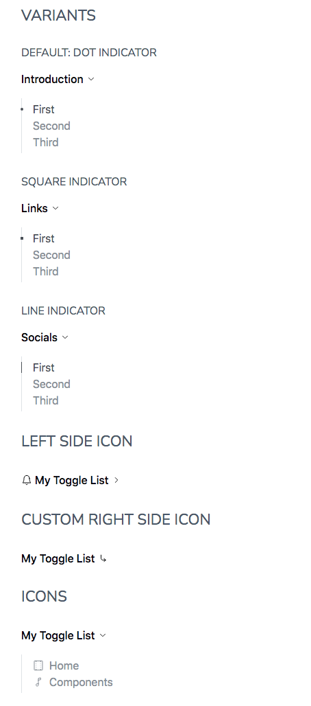

# ToggleList

The **ToggleList** is an accessible Svelte component implementing the [WAI-ARIA Disclosure (Show/Hide) Pattern] and used to enables content to be either collapsed (hidden) or expanded (visible).

A perfect use case for it is with a sidebar menu.

## Examples



## Usage

```html
<script lang="ts">
   import { ToggleList } from '@sveltinio/essentials/list';
   // Sample Icons
   import { LongArrowDownRightIcon } from '@indaco/svelte-iconoir/long-arrow-down-right';
   import { CloudUploadIcon } from '@indaco/svelte-iconoir/cloud-upload';
   import { BellIcon } from '@indaco/svelte-iconoir/bell';
   // sample data
   const contentForToggleList = [
      { label: 'First', url: '#first', icon: CloudUploadIcon },
      { label: 'Second', url: '#second', icon: BellIcon }
   ];
</script>

<ToggleList title="My Toggle List" items={contentForToggleList} />
```

## Properties

The `ToggleList` component exposes a set of properties but it does not prevent you to pass any additional props.

### Functionals

| Property  | Type             | Required | Default | Description                                                                          |
| :-------- | :--------------: | :------: | :-----: | :----------------------------------------------------------------------------------- |
| title     | `string`         | yes      |         | The title for the List                                                               |
| items     | `Array<ListItem>`| yes      |         | An array of objects with `label`, `url` and `icon` props                             |
| open      | `boolean`        | no       | `false` | If true, the list is open by default                                                 |
| showIcon  | `boolean`        | no       | `true`  | If true, shows an icon on the right of the list title                                |
| indicator | `string`         | no       | `dot`   | The visual indicator used when active and hover. One of `['dot', 'square', 'line']`  |
| full      | `boolean`        | no       | `false` | If true, the full size of the container is used. The icons will be placed at the end |

**items** is an array of [ListItem] objects:

```typescript
export type ListItem = {
   label: string;
   url: string;
   icon?: any;
   external?: boolean;
};
```

### Styles

| Property | Type     | Required | Default | Description                                       |
| :------- | :------: | :------: | :-----: | :------------------------------------------------ |
| class    | `string` |    no    |         | The css class name used to make a theme variant   |
| styles   | `object` |    no    | `{}`    | Used to pass CSS variables to apply custom styles |

Refer to the [Theming](#theming) section to learn how those props work and and how to use them.

## Slots

| Name            | Default | Fallback |
| :-------------- | :-----: | :------: |
| `leftIcon`  | ✗       |    ✗     |
| `rightIcon` | ✗       |    ✓     |

## Keyboard Interaction

See the [Keyboard Interaction] section for the [WAI-ARIA Disclosure (Show/Hide) Pattern].

## Theming

To simplify custom styles on the component we used the built-in solution for component theming using [style-props].

The two component properties `styles` and `class` are the ones allowing you to customize the component appearence.

Read more [here](./THEMING.md)

<!-- Resources -->
[WAI-ARIA Disclosure (Show/Hide) Pattern]: https://www.w3.org/WAI/ARIA/apg/patterns/disclosure/examples/disclosure-navigation/
[ListItem]: https://github.com/sveltinio/components-library/blob/358ffd124face5e321b67b528260ee646c60fc30/packages/essentials/src/lib/components/list/types.ts#L1
[Keyboard Interaction]: https://www.w3.org/WAI/ARIA/apg/patterns/disclosure/examples/disclosure-navigation/#kbd_label
[style-props]: https://svelte.dev/docs#template-syntax-component-directives---style-props
