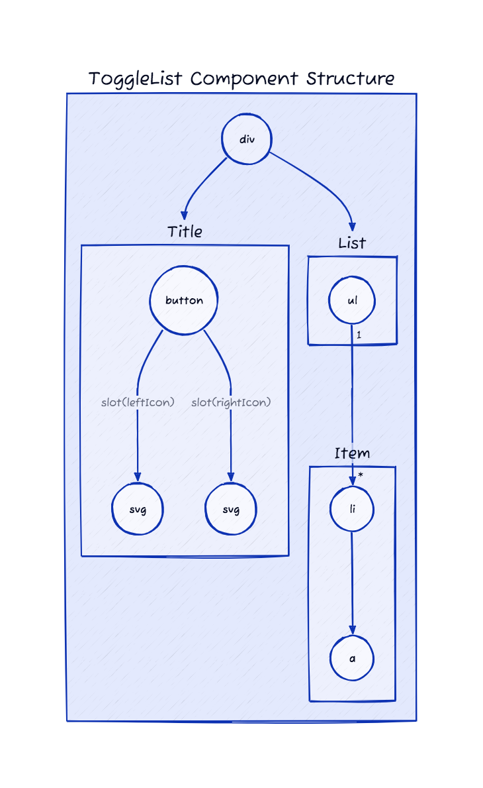
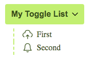

# ToggleList - Theming

To simplify custom styles on the component we used the built-in solution for component theming using [style-props].

The two component properties `styles` and `theme` are the ones allowing you to customize the component appearence.

- `styles` is a JS object with the CSS variable name to override (without `--` prefix) as key and the value set to the allowed one for that CSS variable. This approach helps when you wish to tune few styles for the component.
- `class`: is a global CSS class name where the class content has the CSS variables to override. Using `class` is more suitable when the goal is to create personal versions(themes) for the component, so sevaral props are override;

> Refer to the [Design Rules] document to better understand how the component has been designed and how to customize the styles.

## DOM Element Structure

Below is the DOM Element Structure for the `PagesNavigator` component.

> Legend
>
> - containers: Svelte components
> - circles: HTML elements



## Info Mapping Table

The DOM Element Structure above can be mapped to the following table going through the structure from top to bottom and from left to right.

| Component       | HTML Element & CSS Class Name | CSS Variables Prefix |
| :-------------- | ----------------------------: | -------------------: |
|                 | `div.sn-e-c-dropdown`         |                      |
| DropdownButton  | `sn-e-c-dropdown__button`     | |
| DropdownContent | `sn-e-c-dropdown__list`       | |
| DropdownItem    | `sn-e-c-dropdown__list__item` | |

## CSS Variables

The CSS variables are defined in the [variables.css](./variables.css) file.

## Examples

### Custom Styles with prop



```html
<script>
   import { ToggleList } from '@sveltinio/essentials';
   // sample data
   const contentForToggleList = [
      { label: 'First', url: '#first', icon: CloudUploadIcon },
      { label: 'Second', url: '#second', icon: BellIcon }
   ];

   const customStyles = {
      'btn-color': '#365314',
      'btn-color-hover': '#365314',
      'btn-bg-color': '#bef264',
      'btn-bg-color-hover': '#a3e635',
      'item-border-width': '2px',
      'item-border-style': 'dashed',
      'item-border-color': '#bef264',
      'item-border-color-hover': '#365314',
      'item-color': '#365314',
      'item-bg-color-hover': '#bef264'
   };
</script>

<ToggleList title="My Toggle List" items={contentForToggleList} styles={customStyles} full />
```

### Custom Styles with CSS Class

```css
/* app.css */
.my-togglelist {
  --btn-color: #365314;
  --btn-color-hover: #365314;
  --btn-bg-color: #bef264;
  --btn-bg-color-hover: #a3e635;
  --item-border-width: 2px;
  --item-border-style: dashed;
  --item-border-color: #bef264;
  --item-border-color-hover: #365314;
  --item-color: #365314;
  --item-bg-color-hover: #bef264;
}
```

```html
<script>
   import { ToggleList } from '@sveltinio/essentials';
   // sample data
   const contentForToggleList = [
      { label: 'First', url: '#first', icon: CloudUploadIcon },
      { label: 'Second', url: '#second', icon: BellIcon }
   ];
</script>

<ToggleList title="My Toggle List" items={contentForToggleList} class="my-togglelist" full />
```

<!-- Resources -->
[style-props]: https://svelte.dev/docs#template-syntax-component-directives---style-props
[Design Rules]: https://github.com/sveltinio/components-library/blob/main/docs/design-rules.md
