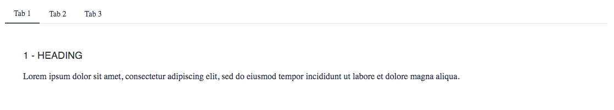
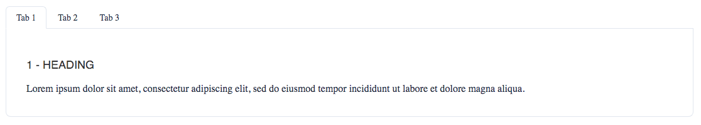

# Tabs

The `Tabs` component is used to easily includes tabs within the page. It supports different variants and sizes:

- **types**: `default`, `bordered`
- **sizes**: `xs`, `sm`, `base` (default), `md`, `lg` and `full`

## Examples

### Default



```html
<script>
   import { Tabs, Tab } '@sveltinio/essentials';
   import DummyIcon from './_dummyIcon.svelte';
</script>

<Tabs>
   <Tab id="1" label="Tab 1">
      <h3>1 - Heading</h3>
      <p>
         Lorem ipsum dolor sit amet, consectetur adipiscing elit, sed do eiusmod tempor
         incididunt ut labore et dolore magna aliqua.
      </p>
   </Tab>
   <Tab id="2" label="Tab 2">
      <h3>2 - Heading</h3>
      <p>
         Lorem ipsum dolor sit amet, consectetur adipiscing elit, sed do eiusmod tempor
         incididunt ut labore et dolore magna aliqua.
      </p>
   </Tab>
   <Tab id="3" label="Tab 3">
      <h3>3 - Heading</h3>
      <p>
         Lorem ipsum dolor sit amet, consectetur adipiscing elit, sed do eiusmod tempor
         incididunt ut labore et dolore magna aliqua.
      </p>
   </Tab>
</Tabs>
```

### Bordered



```html
<script>
   import { Tabs, Tab } '@sveltinio/essentials';
   import DummyIcon from './_dummyIcon.svelte';
</script>

<Tabs activeTab="2" bordered>
   <Tab id="1" label="Tab 1">
      <h3>1 - Heading</h3>
      <p>
         Lorem ipsum dolor sit amet, consectetur adipiscing elit, sed do eiusmod tempor
         incididunt ut labore et dolore magna aliqua.
      </p>
   </Tab>
   <Tab id="2" label="Tab 2">
      <h3>2 - Heading</h3>
      <p>
         Lorem ipsum dolor sit amet, consectetur adipiscing elit, sed do eiusmod tempor
         incididunt ut labore et dolore magna aliqua.
      </p>
   </Tab>
   <Tab id="3" label="Tab 3">
      <h3>3 - Heading</h3>
      <p>
         Lorem ipsum dolor sit amet, consectetur adipiscing elit, sed do eiusmod tempor
         incididunt ut labore et dolore magna aliqua.
      </p>
   </Tab>
</Tabs>
```

## Properties

The `Tabs` and `Tab` components expose a set of properties.

### Tabs - Functionals

| Property  |  Type  | Required | Default      | Description                                                     |
| :-------- | :----: | :------: | :----------: | :-------------------------------------------------------------- |
| activeTab | string |    no    | 1            | The tab to be active (selected) at the startup                  |
| size      | string |    no    | `base`       | Set the tab title size. One of [`xs`, `sm`, `base`, `md`, `lg`] |
| justify   | string |    no    | `start`      | Where to pack the tabs. One of [`start`, `center`, `end`]       |

### Tabs - Styles

| Property |  Type   | Required |   Default   | Description                                       |
| :------- | :-----: | :------: | :---------: | :------------------------------------------------ |
| bordered | boolean |    no    | `false`     | If true, use the component bordered variant       |
| class    | string  |    no    |             | The css class name used to make a theme variant   |
| styles   | Object  |    no    |     `{}`    | Used to pass CSS variables to apply custom styles |

Refer to the [Theming](#theming) section to learn how those props work and and how to use them.

### Tab - Functionals

| Property |  Type   | Required | Default          | Description                                  |
| :------- | :-----: | :------: | :--------------: | :------------------------------------------- |
| id       | string  | yes      |                  | An unique identifier for the tab             |
| label    | string  | yes      |                  | The tab label                                |
| icon     | any     | no       |                  | The icon placed on the left of the tab label |

## Theming

To simplify custom styles on the component we used the built-in solution for component theming using [style-props].

The two component properties `class` and `styles` are the ones allowing you to customize the component appearence.

Read more [here](./THEMING.md)

<!-- Resources -->
[style-props]: https://svelte.dev/docs#template-syntax-component-directives---style-props
