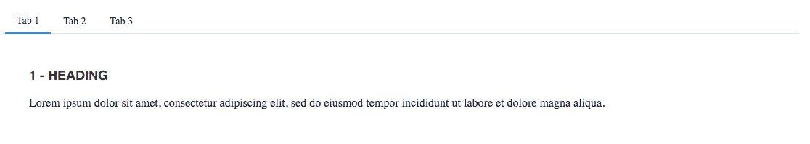
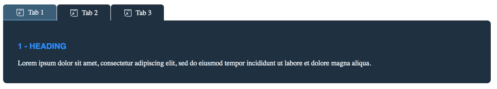
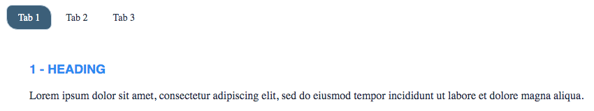
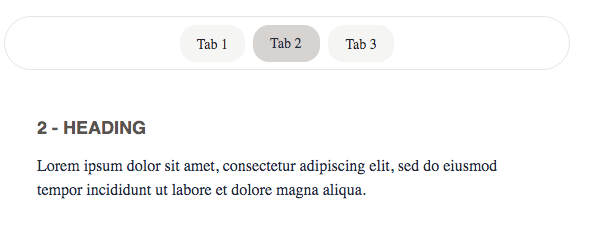
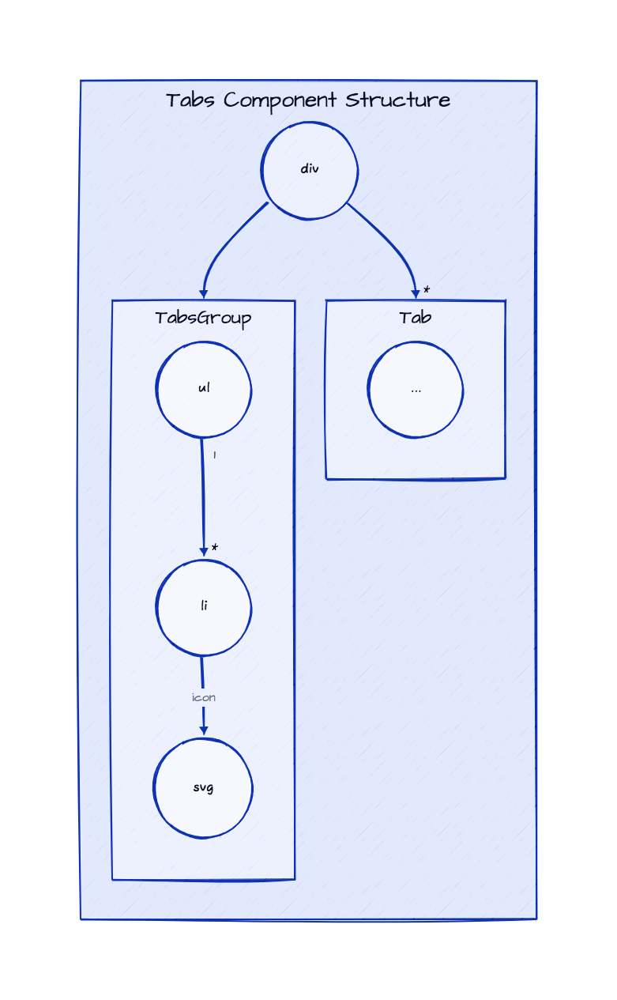

# Theming Tabs Component

To simplify custom styles on the component we used the built-in solution for component theming using [style-props].

The two component properties `styles` and `class` are the ones allowing you to customize the component appearence.

- `styles` is a JS object with the CSS variable name to override (**without** `--` as prefix) as key and the value set to the allowed one for that CSS variable. This approach helps when you wish to tune few styles for the component.
- `class`: is a global CSS class name where the class content has the CSS variables (**with** `--` as prefix) to override. Using `class` is more suitable if the goal is creating personal variants (themes) for the component.

> Refer to the [Design Rules] document to better understand how the component has been designed and how to customize the styles.

## Examples

### Custom Styles with prop



```html
<script lang="ts">
    import { Tabs } from '@sveltinio/essentials/tabs';

    const customStyles = {
        'tab-active-border-b-color': '#0084f6'
    };
</script>

<Tabs activeTab="1" styles={customStyles}>
    <Tabs.Tab id="1" label="Tab 1">
        <h3 style="font-weight: bold;">1 - Heading</h3>
        <p>
            Lorem ipsum dolor sit amet, consectetur adipiscing elit, sed do eiusmod tempor
            incididunt ut labore et dolore magna aliqua.
        </p>
    </Tabs.Tab>
    <Tabs.Tab id="2" label="Tab 2">
        <h3 style="font-weight: bold;">2 - Heading</h3>
        <p>
            Lorem ipsum dolor sit amet, consectetur adipiscing elit, sed do eiusmod tempor
            incididunt ut labore et dolore magna aliqua.
        </p>
    </Tabs.Tab>
    <Tabs.Tab id="3" label="Tab 3"
        ><h3 style="font-weight: bold;">3 - Heading</h3>
        <p>
            Lorem ipsum dolor sit amet, consectetur adipiscing elit, sed do eiusmod tempor
            incididunt ut labore et dolore magna aliqua.
        </p>
    </Tabs.Tab>
</Tabs>
```

### DarkBlue Tabs with CSS Class



```css
.my-tabs {
  --color: #e3ebf2;
  --bg-color: #1d3040;
  --tab-font-size: 1rem;
  --tab-bg-color-hover: #5387b1;
  --tab-pr: 1.75rem;
  --tab-pl: 1.75rem;
  --tabs-group-border-color: transparent;
  --tab-active-bg-color: #385d7b;
  --tab-active-border-b-color: #5387b1;
  --tab-border-b-color-hover: transparent;
  --panel-border-tr-radius: 0.5rem;
}
```

```html
<script lang="ts">
    import { Tabs, Tab } from '@sveltinio/essentials/tabs';
    import DummyIcon from './_dummyIcon.svelte';
</script>

<Tabs activeTab="1" class="my-tabs">
    <Tabs.Tab id="1" label="Tab 1" icon={DummyIcon}>
        <h3 style="color: #0084f6; font-weight: bold;">1 - Heading</h3>
        <p>
            Lorem ipsum dolor sit amet, consectetur adipiscing elit, sed do eiusmod tempor
            incididunt ut labore et dolore magna aliqua.
        </p>
    </Tabs.Tab>
    <Tabs.Tab id="2" label="Tab 2" icon={DummyIcon}>
        <h3 style="color: #0084f6; font-weight: bold;">2 - Heading</h3>
        <p>
            Lorem ipsum dolor sit amet, consectetur adipiscing elit, sed do eiusmod tempor
            incididunt ut labore et dolore magna aliqua.
        </p>
    </Tabs.Tab>
    <Tabs.Tab id="3" label="Tab 3" icon={DummyIcon}>
        <h3 style="color: #0084f6; font-weight: bold;">3 - Heading</h3>
        <p>
            Lorem ipsum dolor sit amet, consectetur adipiscing elit, sed do eiusmod tempor
            incididunt ut labore et dolore magna aliqua.
        </p>
    </Tabs.Tab>
</Tabs>
```

### Rounded Tabs with CSS Class



```css
.rounded-tabs {
  --tabs-group-gap: 0.25rem;
  --tabs-group-border-width: 0px;
  --tabs-group-border-color: transparent;
  --tab-color-hover: white;
  --tab-bg-color-hover: #5387b1;
  --tab-border-tl-radius: 0.5rem;
  --tab-border-tr-radius: 1rem;
  --tab-border-bl-radius: 1rem;
  --tab-border-br-radius: 0.5rem;
  --tab-active-border-t-width: 1px;
  --tab-active-border-t-color: #c7d8e6;
  --tab-active-border-r-width: 1px;
  --tab-active-border-r-color: #c7d8e6;
  --tab-active-border-b-width: 1px;
  --tab-active-border-b-color: #c7d8e6;
  --tab-active-border-l-width: 1px;
  --tab-active-border-l-color: #c7d8e6;
  --tab-active-bg-color: #385d7b;
  --tab-active-color: white;
}
```

```html
<script lang="ts">
    import { Tabs, Tab } from '@sveltinio/essentials/tabs';
    import DummyIcon from './_dummyIcon.svelte';
</script>

<Tabs activeTab="1" class="rounded-tabs ">
    <Tab id="1" label="Tab 1">
        <h3 style="color: #0084f6; font-weight: bold;">1 - Heading</h3>
        <p>
            Lorem ipsum dolor sit amet, consectetur adipiscing elit, sed do eiusmod tempor
            incididunt ut labore et dolore magna aliqua.
        </p>
    </Tab>
    <Tab id="2" label="Tab 2">
        <h3 style="color: #0084f6; font-weight: bold;">2 - Heading</h3>
        <p>
            Lorem ipsum dolor sit amet, consectetur adipiscing elit, sed do eiusmod tempor
            incididunt ut labore et dolore magna aliqua.
        </p>
    </Tab>
    <Tab id="3" label="Tab 3">
        <h3 style="color: #0084f6; font-weight: bold;">3 - Heading</h3>
        <p>
            Lorem ipsum dolor sit amet, consectetur adipiscing elit, sed do eiusmod tempor
            incididunt ut labore et dolore magna aliqua.
        </p>
    </Tab>
</Tabs>
```

### Pills TabsGroup with CSS Class



```css
.pills-tabgroup {
  --max-width: 50%;
  --tabs-group-pt: 0.5rem;
  --tabs-group-pb: 0.5rem;
  --tabs-group-pb: 0.5rem;
  --tabs-group-pb: 0.5rem;
  --tabs-group-gap: 0.5rem;
  --tabs-group-border-t-style: solid;
  --tabs-group-border-t-width: 1px;
  --tabs-group-border-t-color: #e7e5e4;
  --tabs-group-border-r-style: solid;
  --tabs-group-border-r-width: 1px;
  --tabs-group-border-r-color: #e7e5e4;
  --tabs-group-border-b-color: #e7e5e4;
  --tabs-group-border-l-style: solid;
  --tabs-group-border-l-width: 1px;
  --tabs-group-border-l-color: #e7e5e4;
  --tabs-group-border-radius: 99px;
  --tab-color: #292524;
  --tab-bg-color: #f5f5f4;
  --tab-bg-color-hover: #e7e5e4;
  --tab-border-tl-radius: 1rem;
  --tab-border-tr-radius: 1rem;
  --tab-border-bl-radius: 1rem;
  --tab-border-br-radius: 1rem;
  --tab-active-bg-color: #d6d3d1;
  --tab-active-border-b-color: transparent;
}
```

```html
<script lang="ts">
    import { Tabs, Tab } from '@sveltinio/essentials/tabs';
</script>

<Tabs activeTab="2" class="pills-tabgroup" justify="center">
    <Tab id="1" label="Tab 1"
        ><h3 style="color: #57534e; font-weight: bold;">1 - Heading</h3>
        <p>
            Lorem ipsum dolor sit amet, consectetur adipiscing elit, sed do eiusmod tempor
            incididunt ut labore et dolore magna aliqua.
        </p></Tab
    >
    <Tab id="2" label="Tab 2"
        ><h3 style="color: #57534e; font-weight: bold;">2 - Heading</h3>
        <p>
            Lorem ipsum dolor sit amet, consectetur adipiscing elit, sed do eiusmod tempor
            incididunt ut labore et dolore magna aliqua.
        </p></Tab
    >
    <Tab id="3" label="Tab 3"
        ><h3 style="color: #57534e; font-weight: bold;">3 - Heading</h3>
        <p>
            Lorem ipsum dolor sit amet, consectetur adipiscing elit, sed do eiusmod tempor
            incididunt ut labore et dolore magna aliqua.
        </p></Tab
    >
</Tabs>
```

## DOM Element Structure

Below is the DOM Element Structure for the `Tabs` component.

> Legend
>
> - containers: Svelte components
> - circles: HTML elements



## DOM - CSS Variables Mapping Table

The DOM Element Structure above can be mapped to the following table where each component is mapped to the prefix used to identify the CSS variables affecting it.

| Component | CSS Variables Prefix |
| :-------- | -------------------: |
| Tabs      | `tabs-group`         |
| Tabs.Tab  | `tab`                |

### Tabs

| Name                        | Default     |            |
| :-------------------------- | ----------: | :--------: |
| `tabs-group-my`             | 0           | |
| `tabs-group-mx`             | 0           | |
| `tabs-group-py`             | 0           | |
| `tabs-group-px`             | 0           | |
| `tabs-group-gap`            | 0.25rem     | |
| `tabs-group-border-t-width` | 1px         | |
| `tabs-group-border-t-style` | none        | |
| `tabs-group-border-t-color` | transparent | |
| `tabs-group-border-r-width` | 1px         | |
| `tabs-group-border-r-style` | none        | |
| `tabs-group-border-r-color` | transparent | |
| `tabs-group-border-b-width` | 1px         | |
| `tabs-group-border-b-style` | solid       | |
| `tabs-group-border-b-color` | #e9ecef     | <div style="background-color:#e9ecef; width:15px; height: 15px" /> |
| `tabs-group-border-l-width` | 1px         | |
| `tabs-group-border-l-style` | none        | |
| `tabs-group-border-l-color` | transparent | |
| `tabs-group-border-radius`  | 0           | |

### Tabs.Tab

| Name                       | Default     |            |
| :------------------------- | ----------: | :--------: |
| `tab-py`                   | 0.5rem      | |
| `tab-px`                   | 1rem        | |
| `tab-gap`                  | 0.5rem      | |
| `tab-color`                | #0d0f12     | <div style="background-color:#e9ecef; width:15px; height: 15px" /> |
| `tab-color-hover`          | #0d0f12     | <div style="background-color:#e9ecef; width:15px; height: 15px" /> |
| `tab-font-family`          | system-ui, -apple-system, <br/>Segoe UI, Roboto, Ubuntu, <br/> Cantarell, Noto Sans, sans-serif; | |
| `tab-font-size`            | 0.75rem     | |
| `tab-font-weight`          | 500         | |
| `tab-line-height`          | 1.25        | |
| `tab-letter-spacing`       | 0.025em     | |
| `tab-text-decoration`      | none        | |
| `tab-bg-color`             | transparent | |
| `tab-bg-color-hover`       | #f8f9fa     | <div style="background-color:#f8f9fa; width:15px; height: 15px" /> |
| `tab-border-t-width`       | 1px         | |
| `tab-border-t-style`       | solid       | |
| `tab-border-t-color`       | transparent | |
| `tab-border-t-color-hover` | transparent | |
| `tab-border-r-width`       | 1px         | |
| `tab-border-r-style`       | solid       | |
| `tab-border-r-color`       | transparent | |
| `tab-border-r-color-hover` | transparent | |
| `tab-border-b-width`       | 1px         | |
| `tab-border-b-style`       | solid       | |
| `tab-border-b-color`       | transparent | |
| `tab-border-b-color-hover` | transparent | |
| `tab-border-l-width`       | 1px         | |
| `tab-border-l-style`       | solid       | |
| `tab-border-l-color`       | transparent | |
| `tab-border-l-color-hover` | transparent | |
| `tab-border-tl-radius`     | 5px         | |
| `tab-border-tr-radius`     | 5px         | |
| `tab-border-bl-radius`     | 5px         | |
| `tab-border-br-radius`     | 5px         | |
| `tab-ring-width`           | 1px         | |
| `tab-ring-style`           | solid       | |
| `tab-ring-color`           | #f1f3f5     | <div style="background-color:#f1f3f5; width:15px; height: 15px" /> |
| `tab-ring-offset`          | 1px         | |

#### Active Tab

| Name                        | Default     |            |
| :-------------------------- | ----------: | :--------: |
| `tab-active-color`          | #16191d     | <div style="background-color:#16191d; width:15px; height: 15px" /> |
| `tab-active-bg-color`       | #16191d     | <div style="background-color:#16191d; width:15px; height: 15px" /> |
| `tab-active-border-t-width` | 1px         | |
| `tab-active-border-t-style` | solid       | |
| `tab-active-border-t-color` | transparent | |
| `tab-active-border-r-width` | 1px         | |
| `tab-active-border-r-style` | solid       | |
| `tab-active-border-r-color` | transparent | |
| `tab-active-border-b-width` | 2px         | |
| `tab-active-border-b-style` | solid       | |
| `tab-active-border-b-color` | #868e96     | <div style="background-color:#868e96; width:15px; height: 15px" /> |
| `tab-active-border-l-width` | 1px         | |
| `tab-active-border-l-style` | solid       | |
| `tab-active-border-l-color` | transparent | |

#### Content

| Name                       | Default     |            |
| :------------------------- | ----------: | :--------: |
| `content-mt`               | 0           | |
| `content-mx`               | 0           | |
| `content-py`               | 1.75rem     | |
| `content-px`               | 1.75rem     | |
| `content-color`            | #16191d     | <div style="background-color:#16191d; width:15px; height: 15px" /> |
| `content-bg-color`         | #16191d     | <div style="background-color:#16191d; width:15px; height: 15px" /> |
| `content-font-size`        | 1rem        | |
| `content-font-weight`      | 500         | |
| `content-line-height`      | 1.5rem      | |
| `content-letter-spacing`   | 1.1         | |
| `content-text-align`       | left        | |
| `content-bg-color`         | #ffffff     | <div style="background-color:#ffffff; width:15px; height: 15px" /> |
| `content-border-width`     | 1px         | |
| `content-border-style`     | solid       | |
| `content-border-color`     | transparent | |
| `content-border-tl-radius` | 0           | |
| `content-border-tr-radius` | 0           | |
| `content-border-bl-radius` | 0.5rem      | |
| `content-border-br-radius` | 0.5rem      | |

#### Tab sizes

##### sm

| Name                | Default |
| :------------------ | ------: |
| `font-size-sm`      | 0.75rem |
| `font-weight-sm`    | 400     |
| `line-height-sm`    | 0.95    |
| `letter-spacing-sm` | -0.05em |

##### Default (base)

| Name                  | Default |
| :-------------------- | ------: |
| `font-size-base`      | 1rem    |
| `font-weight-base`    | 500     |
| `line-height-base`    | 1.1     |
| `letter-spacing-base` | 0.025em |

##### lg

| Name                | Default |
| :------------------ | ------: |
| `font-size-lg`      | 1.1rem  |
| `font-weight-lg`    | 500     |
| `line-height-lg`    | 1.375   |
| `letter-spacing-lg` | 0.025em |
