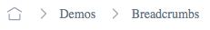

# Breadcrumbs

Breadcrumbs helps users to navigate through the website.

## Examples



## Usage

```html
<script>
    import { page } from '$app/stores';
    import { Breadcrumbs } from '@sveltinio/widgets';
<script>

<Breadcrumbs url="http://example.com/blog/posts/welcome" />

<!-- SvelteKit example -->
<Breadcrumbs url={$page.url.href} />
```

## Properties

The `Breadcrumbs` component exposes the following properties:

### Functionals

| Property    | Type    | Required | Default | Description                                         |
| :---------- | :-----: | :------: | :-----: | :-------------------------------------------------- |
| url         | string  |    yes   |         | An absolute or relative URL string                  |
| showCurrent | boolean |    no    | `true`  | If false, the current item it not on the bradcrumbs |

### Styles

| Property    | Type    | Required | Default | Description                                         |
| :---------- | :-----: | :------: | :-----: | :-------------------------------------------------- |
| class       | string  |    no    |         | The css class name used to make a theme variant     |
| styles      | Object  |    no    | `{}`    | Used to pass CSS variables to apply custom styles   |

## Slots

| Name          | Default | Fallback |
| :------------ | :-----: | :------: |
| `baseIcon`    | ✗       |    ✓     |
| `dividerIcon` | ✗       |    ✓     |

## Theming

To simplify custom styles on the component we used the built-in solution for component theming using [style-props].

Please, refer to the [Design Rules] document to better understand how the component has been designed and how to customize the styles.

The CSS variables are defined in the [variables.css](./variables.css) file.

<!-- Resources -->
[style-props]: https://svelte.dev/docs#template-syntax-component-directives---style-props
[Design Rules]: https://github.com/sveltinio/components-library/blob/main/docs/design-rules.md
