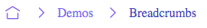

# Breadcrumbs - Theming

To simplify custom styles on the component we used the built-in solution for component theming using [style-props].

The two component properties `styles` and `theme` are the ones allowing you to customize the component appearence.

- `styles` is a JS object with the CSS variable name to override (without `--` prefix) as key and the value set to the allowed one for that CSS variable. This approach helps when you wish to tune few styles for the component.
- `class`: is a global CSS class name where the class content has the CSS variables to override. Using `class` is more suitable when the goal is to create personal versions(themes) for the component, so sevaral props are override;

> Refer to the [Design Rules] document to better understand how the component has been designed and how to customize the styles.

## CSS Variables

The CSS variables are defined in the [variables.css](../../styles/components/breadcrumbs/variables.css) file.

## Examples

### Custom Styles with prop



```html
<script lang="ts">
    import { Breadcrumbs } from '@sveltinio/widgets';

    const customStyles = {
        'icon-color': '#8b5cf6',
        'icon-color-hover': '#4338ca',
        'parent-color': '#8b5cf6',
        'parent-color-hover': '#4338ca',
        'current-color': '#4338ca'
    };
</script>

<Breadcrumbs url="http://example.com/blog/posts/welcome" styles={customStyles}/>
```

### Custom Styles with CSS Class


```css
/* app.css */
.breadcrumbs-purple {
  --icon-color: #8b5cf6;
  --icon-color-hover: #4338ca;
  --parent-color: #8b5cf6;
  --parent-color-hover: #4338ca;
  --current-color: #4338ca;
}
```

```html
<script lang="ts">
    import { Breadcrumbs } from '@sveltinio/widgets';
</script>

<Breadcrumbs url="http://example.com/blog/posts/welcome" class="breadcrumbs-purple"/>
```
