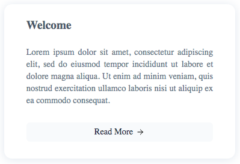
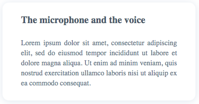

# Card

The `Card` component is used to group and display content in a easily readable way.

## Examples

### Default



<details><summary>Source Code</summary>

```html
<script>
   import { base } from '$app/paths';
   import { Card, CardAction } from '@sveltinio/widgets';
</script>

<Card
    title="The microphone and the voice"
    content="Lorem ipsum dolor sit amet, consectetur adipiscing elit, sed do eiusmod tempor incididunt..."
>
    <CardAction
        slot="cardAction"
        label="Read the article"
        href="{base}/microphone"
    />
</Card>
```

</details>

### Title as link



<details><summary>Source Code</summary>

```html
<script>
   import { base } from '$app/paths';
   import { Card } from '@sveltinio/widgets';
</script>

<Card
    title="The microphone and the voice"
    content="Lorem ipsum dolor sit amet, consectetur adipiscing elit, sed do eiusmod tempor incididunt..."
    href="{base}/microphone"
>
</Card>
```

</details>

### Complete


<details><summary>Source Code</summary>

```html
<script>
   import { base } from '$app/paths';
   import { Card, CardImage, CardAction } from '@sveltinio/widgets';
</script>

<Card title="The microphone and the voice" content="Lorem ipsum dolor sit amet, consectetur adipiscing elit, sed do eiusmod tempor incididunt...">
    <CardImage
        slot="cardImage"
        alt="alt text"
        src="{assets}/microphone.jpeg"
    />
    <CardAction
        slot="cardAction"
        href="{base}/microphone"
    />
</Card>
```

</details>

## Properties

The `Card` component exposes the following properties:

### Functionals

| Property    | Type   | Required | Default | Description                                                 |
| :---------- | :----: | :------: | :-----: | :---------------------------------------------------------- |
| `title`     | string |   yes    |         | The card title text                                         |
| `content`   | string |   yes    |         | The card content text                                       |
| `href`      | string |    no    |         | If set, the title is a link to the href                     |
| `lineClamp` | number |    no    | `4`     | The number of lines after which the content will be clamped |

### Styles

| Property    | Type   | Required | Default | Description                                       |
| :---------- | :----: | :------: | :-----: | :------------------------------------------------ |
| `class`     | string |    no    |         | The css class name used to make a theme variant   |
| `styles`    | Object |    no    |   `{}`  | Used to pass CSS variables to apply custom styles |

Refer to the [Theming](#theming) section to learn how those props work and and how to use them.

## Slots

Slots are used to place contents in the card component.

The `Card` component provides two slots:

- `cardImage`
- `cardAction`

## Theming

To simplify custom styles on the component we used the built-in solution for component theming using [style-props].

The two component properties `styles` and `class` are the ones allowing you to customize the component appearence.

Read more [here](./THEMING.md)

<!-- Resources -->
[style-props]: https://svelte.dev/docs#template-syntax-component-directives---style-props
