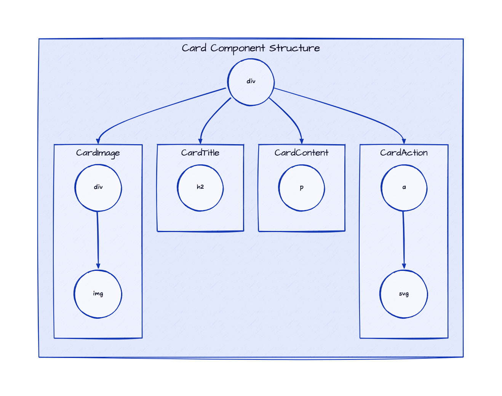

# Card - Theming

To simplify custom styles on the component we used the built-in solution for component theming using [style-props].

The two component properties `styles` and `class` are the ones allowing you to customize the component appearence.

- `styles` is a JS object with the CSS variable name to override (without `--` prefix) as key and the value set to the allowed one for that CSS variable. This approach helps when you wish to tune few styles for the component.
- `class`: is a global CSS class name where the class content has the CSS variables to override. Using `class` is more suitable when the goal is to create personal versions(themes) for the component, so sevaral props are override;

> Refer to the [Design Rules] document to better understand how the component has been designed and how to customize the styles.

## DOM Element Structure

Below is the DOM Element Structure for the `Card` component.

> Legend
>
> - containers: Svelte components
> - circles: HTML elements

## Info Mapping Table

The DOM Element Structure above can be mapped to the following table going through the structure from top to bottom and from left to right.

| Component   | HTML Elem | CSS Class Name  | CSS Variables Prefix |
| :---------- | --------: | --------------: | -------------------: |
|             | `div`     | `sn-e-c-card`   |                      |
| CardImage   |           | `card__image`   | `img`                |
| CardTitle   |           | `card__title`   | `title`              |
| CardContent |           | `card__content` | `content`            |
|             | `div`     | `footer`        | `footer`             |
| CardAction  |           | `card__action`  | `btn`                |

## CSS Variables

The CSS variables are defined in the [variables.css](../../styles/components/card/variables.css) file.

<!-- Resources -->
[style-props]: https://svelte.dev/docs#template-syntax-component-directives---style-props
[Design Rules]: https://github.com/sveltinio/components-library/blob/main/docs/design-rules.md
