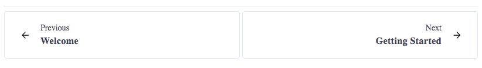

# PagesNavigator

## Examples



<details><summary>Source Code</summary>

```html
<script>
    import { PagesNavigator } from '@sveltinio/widgets';

    const prevObj = { label: 'prev title', href: 'link_previous_slug' };
    const nextObj = { label: 'next title', href: 'link_next_slug' }
</script>

<PagesNavigator prev={prevObj} next={nextObj} />
```

</details>

## Properties

The `PagesNavigator` component exposes the following properties:

| Property     | Type                 | Required | Default | Description |
| :----------- | :------------------: | :------: | :-----: | :---------- |
| prev         | `PagesNavigatorItem` |    yes   |         | |
| next         | `PagesNavigatorItem` |    yes   |         | |
| placeholders |   `boolean`          |    no    |  `true` | If false, does not show the placeholders 'previous' and 'next' |
| labels       |   `boolean`          |    no    |  `true` | If false, does not show the labels (titles)                    |
| spacer       |   `boolean`          |    no    | `false` | If true, shows a vertical line between left and right content  |
| theme        |    string            |    no    |         | The css class name used to make a theme variant                |
| styles       |    Object            |    no    |   `{}`  | Used to pass CSS variables to apply custom styles              |

**prev** and **next** are `PagesNavigatorItem` objects:

```typescript
type PagesNavigatorItem = {
   placeholder?: string;
   label: string;
   href: string;
   alt?: string;
};
```

## Slots

Slots are used to replace the default icons for previous and next with your favourite ones.

<details><summary>Source Code</summary>

```html
<script>
    import { PagesNavigator } from '@sveltinio/widgets';

    const prevObj = { label: 'prev title', href: 'link_previous_slug' };
    const nextObj = { label: 'next title', href: 'link_next_slug' }
</script>

<PagesNavigator prev={prevObj} next={nextObj} >
    <span slot="previous-icon">
        <svg
            xmlns="http://www.w3.org/2000/svg"
            width="24px"
            height="24px"
            stroke-width="1.5"
            viewBox="0 0 24 24"
            fill="none"
            class="icon"
            color="currentColor"
            ><path
                d="M16 12H8m0 0l3.5 3.5M8 12l3.5-3.5M12 22c5.523 0 10-4.477 10-10S17.523 2 12 2 2 6.477 2 12s4.477 10 10 10z"
                stroke="currentColor"
                stroke-width="1.5"
                stroke-linecap="round"
                stroke-linejoin="round"
            /></svg
        >
    </span>

    <span slot="next-icon">
        <svg
            xmlns="http://www.w3.org/2000/svg"
            width="24px"
            height="24px"
            stroke-width="1.5"
            viewBox="0 0 24 24"
            fill="none"
            class="icon"
            color="currentColor"
            ><path
                d="M8 12h8m0 0l-3.5-3.5M16 12l-3.5 3.5M12 22c5.523 0 10-4.477 10-10S17.523 2 12 2 2 6.477 2 12s4.477 10 10 10z"
                stroke="currentColor"
                stroke-width="1.5"
                stroke-linecap="round"
                stroke-linejoin="round"
            /></svg
        >
    </span>
</PagesNavigator>
```

</details>

## Theming

To simplify custom styles on the component we used the built-in solution for component theming using [style-props].

The two component properties `styles` and `theme` are the ones allowing you to customize the component appearence.

Read more [here](./THEMING.md)

<!-- Resources -->
[style-props]: https://svelte.dev/docs#template-syntax-component-directives---style-props
