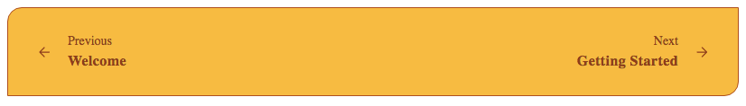

# PagesNavigator

## Examples


```html
<script>
    import { PagesNavigator } from '@sveltinio/widgets';

    const prevObj = { label: 'prev title', href: 'link_previous_slug' };
    const nextObj = { label: 'next title', href: 'link_next_slug' }
</script>

<PagesNavigator prev={prevObj} next={nextObj} />
```

## Properties

The `PagesNavigator` component exposes the following properties:

| Property     | Type                 | Required | Default | Description |
| :----------- | :------------------: | :------: | :-----: | :---------- |
| prev         | `PagesNavigatorItem` |    yes   |         | |
| next         | `PagesNavigatorItem` |    yes   |         | |
| placeholders |   `boolean`          |    no    |  `true` | If false, does not show the placeholders 'previous' and 'next' |
| labels       |   `boolean`          |    no    |  `true` | If false, does not show the labels (titles)                    |
| spacer       |   `boolean`          |    no    | `false` | If true, shows a vertical line between left and right content  |
| theme        |    string            |    no    |         | The css class name used to make a theme variant                |
| styles       |    Object            |    no    |   `{}`  | Used to pass CSS variables to apply custom styles              |

**prev** and **next** are `PagesNavigatorItem` objects:

```typescript
type PagesNavigatorItem = {
   placeholder?: string;
   label: string;
   href: string;
   alt?: string;
};
```

## Slots

Slots are used to replace the default icons for previous and next with your favourite ones.

```html
<script>
    import { PagesNavigator } from '@sveltinio/widgets';

    const prevObj = { label: 'prev title', href: 'link_previous_slug' };
    const nextObj = { label: 'next title', href: 'link_next_slug' }
</script>

<PagesNavigator prev={prevObj} next={nextObj} >
    <span slot="previous-icon">
        <svg
            xmlns="http://www.w3.org/2000/svg"
            width="24px"
            height="24px"
            stroke-width="1.5"
            viewBox="0 0 24 24"
            fill="none"
            class="icon"
            color="currentColor"
            ><path
                d="M16 12H8m0 0l3.5 3.5M8 12l3.5-3.5M12 22c5.523 0 10-4.477 10-10S17.523 2 12 2 2 6.477 2 12s4.477 10 10 10z"
                stroke="currentColor"
                stroke-width="1.5"
                stroke-linecap="round"
                stroke-linejoin="round"
            /></svg
        >
    </span>

    <span slot="next-icon">
        <svg
            xmlns="http://www.w3.org/2000/svg"
            width="24px"
            height="24px"
            stroke-width="1.5"
            viewBox="0 0 24 24"
            fill="none"
            class="icon"
            color="currentColor"
            ><path
                d="M8 12h8m0 0l-3.5-3.5M16 12l-3.5 3.5M12 22c5.523 0 10-4.477 10-10S17.523 2 12 2 2 6.477 2 12s4.477 10 10 10z"
                stroke="currentColor"
                stroke-width="1.5"
                stroke-linecap="round"
                stroke-linejoin="round"
            /></svg
        >
    </span>
</PagesNavigator>
```

## Theming

To simplify custom styles on the component we used the built-in solution for component theming using [style-props].

Please, refer to the [Design Rules] document to better understand how the component has been designed and how to customize the styles.

The CSS variables are defined in the [variables.css](./variables.css) file.

### Examples

#### Custom Styles - Sample 1

```html
<script>
    import { PagesNavigator } from '@sveltinio/widgets';

    const prevObj = { label: 'prev title', href: 'link_previous_slug' };
    const nextObj = { label: 'next title', href: 'link_next_slug' }
    const customStyles_1 = {
        'border-t-width': '2px',
        'border-t-color': '#374151',
        'spacer-color': '#6b7280',
        'link-border-color': 'transparent',
        'link-bg-color': 'transparent',
        'link-bg-color-hover': 'transparent',
        'content-max-width-md': '100%',
        'content-max-width-lg': '50%',
        'content-bg-color': '#f3f4f6',
        'content-border-color': '#e5e7eb',
        'content-border-color-hover': '#6b7280'
    };
</script>

<PagesNavigator prev={prevObj} next={nextObj} styles={customStyles_1} spacer />
```


#### Custom Styles - Sample 2

```html
<script>
    import { PagesNavigator } from '@sveltinio/widgets';

    const prevObj = { label: 'prev title', href: 'link_previous_slug' };
    const nextObj = { label: 'next title', href: 'link_next_slug' }
    const dark = {
        'border-t-color': 'rgb(15 23 42)',
        'bg-color': 'rgb(71 85 105)',
        'link-border-color': 'transparent',
        'link-bg-color': 'transparent',
        'link-bg-color-hover': 'transparent',
        'content-max-width-md': '70%',
        'content-max-width-lg': '40%',
        'content-l-ml': 'auto',
        'content-l-mr-md': '2rem',
        'content-l-text-align': 'right',
        'content-r-ml-md': '2rem',
        'content-r-mr-md': 'auto',
        'content-r-text-align': 'left',
        'content-bg-color-hover': '#64748b',
        'content-border-color': '#64748b',
        'placeholder-color': '#e2e8f0',
        'placeholder-letter-spacing': '0.025em',
        'message-color': '#e2e8f0',
        'message-font-weight': '500',
        'message-letter-spacing': '0.05em'
    };
</script>

<PagesNavigator prev={prevObj} next={nextObj} styles={dark} spacer />
```


#### Custom Styles with CSS class as theme

```css
/* app.css */
.pagesnav-orange {
  --max-width: 80rem;
  --bg-color: #fbbf24;
  --border-t-color: #b45309;
  --border-r-color: #b45309;
  --border-b-color: #b45309;
  --border-l-color: #b45309;
  --border-tl-radius: 1rem;
  --border-br-radius: 1rem;
  --link-border-color: transparent;
  --link-bg-color: transparent;
  --link-bg-color-hover: transparent;
  --content-bg-color-hover: #fcd34d;
  --content-border-color: transparent;
  --content-border-color-hover: #f59e0b;
  --content-ml: 4px;
  --content-mr: 4px;
  --placeholder-color: #92400e;
  --message-color: #92400e;
  --icon-color: #92400e;
}
```

```html
<script>
    import { PagesNavigator } from '@sveltinio/widgets';

    const prevObj = { label: 'prev title', href: 'link_previous_slug' };
    const nextObj = { label: 'next title', href: 'link_next_slug' }
</script>

<PagesNavigator prev={prevObj} next={nextObj} theme="pagesnav-orange" />
```



<!-- Resources -->
[style-props]: https://svelte.dev/docs#template-syntax-component-directives---style-props
[Design Rules]: https://github.com/sveltinio/components-library/blob/main/docs/design-rules.md
