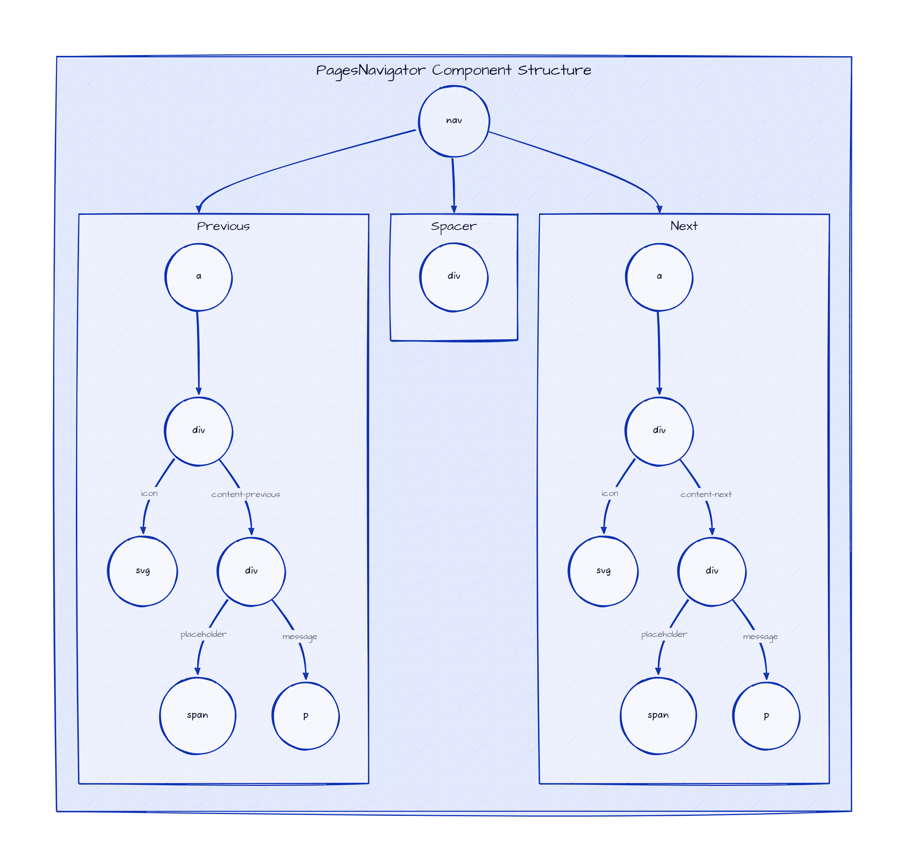

# PagesNavigator - Theming

To simplify custom styles on the component we used the built-in solution for component theming using [style-props].

The two component properties `styles` and `class` are the ones allowing you to customize the component appearence.

- `styles` is a JS object with the CSS variable name to override (without `--` prefix) as key and the value set to the allowed one for that CSS variable. This approach helps when you wish to tune few styles for the component.
- `class`: is a global CSS class name where the class content has the CSS variables to override. Using `class` is more suitable when the goal is to create personal versions(themes) for the component, so sevaral props are override;

> Refer to the [Design Rules] document to better understand how the component has been designed and how to customize the styles.

## DOM Element Structure

Below is the DOM Element Structure for the `PagesNavigator` component.

> Legend
>
> - containers: Svelte components
> - circles: HTML elements



## Info Mapping Table

The DOM Element Structure above can be mapped to the following table going through the structure from top to bottom and from left to right.

| Component | HTML Elem | CSS Class Name         | CSS Variables Prefix |
| :-------- | --------: | ---------------------: | -------------------: |
|           | `div`     | `sn-e-c-pagesnav`      |                      |
| Previous  | `a`       | `link`                 | `link`               |
| Previous  | `div`     | `content`              | `content`            |
| Previous  | `svg`     | `content__icon`        | `icon`               |
| Previous  | `div`     | `content__previous`    | `content-l`          |
| Previous  | `svg`     | `content__placeholder` | `placeholder`        |
| Previous  | `svg`     | `content__message`     | `message`            |
| Spacer    | `div`     | `spacer`               | `spacer`             |
| Next      | `a`       | `link`                 | `link`               |
| Next      | `div`     | `content`              | `content`            |
| Next      | `svg`     | `content__icon`        | `icon`               |
| Next      | `div`     | `content__previous`    | `content-r`          |
| Next      | `svg`     | `content__placeholder` | `placeholder`        |
| Next      | `svg`     | `content__message`     | `message`            |

## CSS Variables

The CSS variables are defined in the [variables.css](../../styles/components/pagesnavigator/variables.css) file.

## Examples

### Custom Styles - Sample 1


```html
<script>
    import { PagesNavigator } from '@sveltinio/widgets';

    const prevObj = { label: 'prev title', href: 'link_previous_slug' };
    const nextObj = { label: 'next title', href: 'link_next_slug' }
    const customStyles_1 = {
        'border-t-width': '2px',
        'border-t-color': '#374151',
        'spacer-color': '#6b7280',
        'link-border-color': 'transparent',
        'link-bg-color': 'transparent',
        'link-bg-color-hover': 'transparent',
        'content-max-width-md': '100%',
        'content-max-width-lg': '50%',
        'content-bg-color': '#f3f4f6',
        'content-border-color': '#e5e7eb',
        'content-border-color-hover': '#6b7280'
    };
</script>

<PagesNavigator prev={prevObj} next={nextObj} styles={customStyles_1} spacer />
```

### Custom Styles - Sample 2


```html
<script>
    import { PagesNavigator } from '@sveltinio/widgets';

    const prevObj = { label: 'prev title', href: 'link_previous_slug' };
    const nextObj = { label: 'next title', href: 'link_next_slug' }
    const dark = {
        'border-t-color': 'rgb(15 23 42)',
        'bg-color': 'rgb(71 85 105)',
        'link-border-color': 'transparent',
        'link-bg-color': 'transparent',
        'link-bg-color-hover': 'transparent',
        'content-max-width-md': '70%',
        'content-max-width-lg': '40%',
        'content-l-ml': 'auto',
        'content-l-mr-md': '2rem',
        'content-l-text-align': 'right',
        'content-r-ml-md': '2rem',
        'content-r-mr-md': 'auto',
        'content-r-text-align': 'left',
        'content-bg-color-hover': '#64748b',
        'content-border-color': '#64748b',
        'placeholder-color': '#e2e8f0',
        'placeholder-letter-spacing': '0.025em',
        'message-color': '#e2e8f0',
        'message-font-weight': '500',
        'message-letter-spacing': '0.05em'
    };
</script>

<PagesNavigator prev={prevObj} next={nextObj} styles={dark} spacer />
```

### Custom Styles with CSS class as theme


```css
/* app.css */
.pagesnav-orange {
  --max-width: 80rem;
  --bg-color: #fbbf24;
  --border-t-color: #b45309;
  --border-r-color: #b45309;
  --border-b-color: #b45309;
  --border-l-color: #b45309;
  --border-tl-radius: 1rem;
  --border-br-radius: 1rem;
  --link-border-color: transparent;
  --link-bg-color: transparent;
  --link-bg-color-hover: transparent;
  --content-bg-color-hover: #fcd34d;
  --content-border-color: transparent;
  --content-border-color-hover: #f59e0b;
  --content-ml: 4px;
  --content-mr: 4px;
  --placeholder-color: #92400e;
  --message-color: #92400e;
  --icon-color: #92400e;
}
```

```html
<script>
    import { PagesNavigator } from '@sveltinio/widgets';

    const prevObj = { label: 'prev title', href: 'link_previous_slug' };
    const nextObj = { label: 'next title', href: 'link_next_slug' }
</script>

<PagesNavigator prev={prevObj} next={nextObj} class="pagesnav-orange" />
```

<!-- Resources -->
[style-props]: https://svelte.dev/docs#template-syntax-component-directives---style-props
[Design Rules]: https://github.com/sveltinio/components-library/blob/main/docs/design-rules.md
