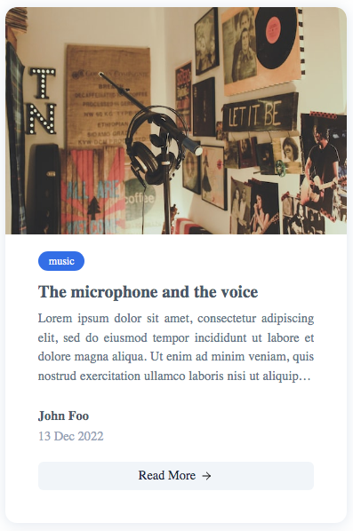
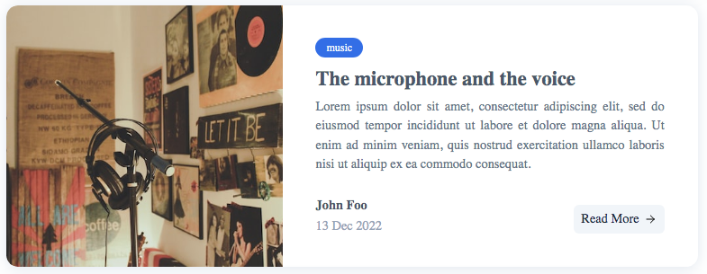

# ResponsiveCard

The `ResponsiveCardCard` component is used to group and display content in a easily readable way. It displays content vertically on small screen and horizontally on large screen.

## Examples

| Mobile                                   | Desktop |
| :--------------------------------------: | :-----------: |
|  |  |

## Usage

```html
import {
    ResponsiveCard,
    ResponsiveCardImage,
    ResponsiveCardBadge,
    ResponsiveCardInfo,
    ResponsiveCardAction
} from '@sveltinio/widgets/responsive-card';

<ResponsiveCard
    title="The microphone and the voice"
    content="Lorem ipsum dolor sit amet, consectetur adipiscing elit, sed do eiusmod tempor incididunt..."
>
    <ResponsiveCardImage slot="cardImage"
        src="https://source.unsplash.com/600x400/?music"
        alt="microphone photo"
    />
    <ResponsiveCardBadge slot="cardBadge"
        data={{
            value: "music",
            color: "blue",
            url: ""
        }}
    />
    <ResponsiveCardInfo slot="cardInfo" author="John Foo" date="13 Dec 2022" />
    <ResponsiveCardAction slot="cardAction" href="" />
</ResponsiveCard>
```

## Properties

The `ResponsiveCard` component exposes the following properties:

### Functionals

| Property     | Type          | Required | Default | Description                                                 |
| :----------- | :-----------: | :------: | :-----: | :---------------------------------------------------------- |
| title`       | `string`      |   yes    |         | The card title text                                         |
| content      | `string`      |   yes    |         | The card content text                                       |
| href         | `string`      |    no    |         | If set, the title is a link to the href                     |
| lineClamp    | `number`      |    no    | `4`     | The number of lines after which the content will be clamped |
| titleLink    | `boolean`     |    no    | `true`  | if true, the title is rendered a link to the content too    |
| prefetch     |               |    no    | `off`   | Set `data-sveltekit-preload-data` link option               |

### Styles

| Property  | Type     | Required | Default | Description                                                 |
| :-------- | :------: | :------: | :-----: | :---------------------------------------------------------- |
| class     | `string` |    no    |         | The css class name used to make a theme variant             |
| styles    | `object` |    no    |   `{}`  | Used to pass CSS variables to apply custom styles           |

Refer to the [Theming](#theming) section to learn how those props work and and how to use them.

## Slots

| Name         | Default | Fallback |
| :----------- | :-----: | :------: |
| `cardImage`  | ✗       |    ✗     |
| `cardBadge`  | ✗       |    ✗     |
| `cardInfo`   | ✗       |    ✗     |
| `cardAction` | ✗       |    ✗     |

## Theming

To simplify custom styles on the component we used the built-in solution for component theming using [style-props].

The two component properties `styles` and `class` are the ones allowing you to customize the component appearence.

Read more [here](./THEMING.md)

<!-- Resources -->
[style-props]: https://svelte.dev/docs#template-syntax-component-directives---style-props
