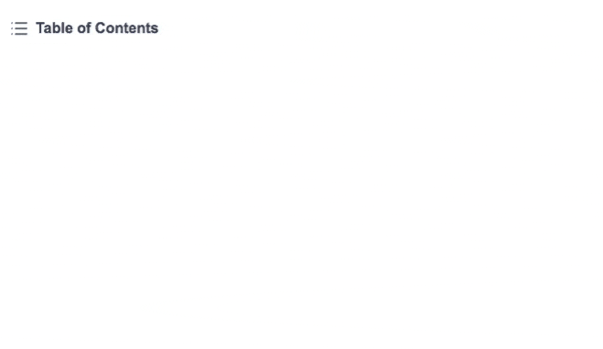
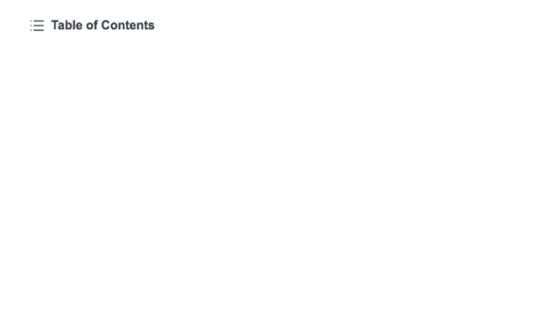
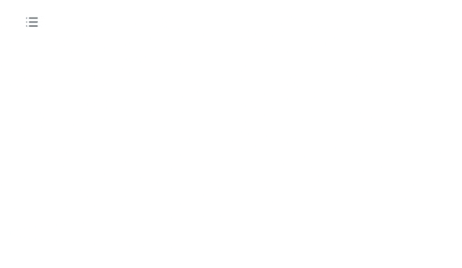

# TOC

Responsive and accessible ([WAI-ARIA Accessibility Reference]) Table of contents component.

## Examples

### Default



### Ordered



### Icon Only



## Usage

```html
<script>
    import { TOC } from '@sveltinio/widgets';
</script>

<TOC data={tocEntries} />
```

### mdsvex & SvelteKit

You can use [@sveltinio/remark-headings](https://github.com/sveltinio/remark-headings) to get the headings tree data to be passed to the `TOC` component like so:

```javascript
// mdsvex.config.js
import rehypeSlug from 'rehype-slug';
import rehypeAutoLinkHeadings from 'rehype-autolink-headings';
import headings from "@sveltinio/remark-headings";

export default {
  // ... rest of your config
  remarkPlugins: [headings],
  rehypePlugins: [
    rehypeSlug,
    [(rehypeAutoLinkHeadings, { behavior: 'wrap' })]
  ]
};
```

```html
<!-- +page.svx -->
<script>
    import { TOC } from '@sveltinio/widgets';
</script>

<TOC data={headings} />
```

## Properties

The `TOC` component exposes the following properties:

### Functionals

| Property   | Type              | Required | Default             | Description                                   |
| :--------- | :---------------: | :------: | :-----------------: | :-------------------------------------------- |
| data       | `Array<TocEntry>` |   yes    |                     | The data tree to be rendered                  |
| label      | `string`          |   no     | `Table of Contents` | The text to be showed on the button           |
| full       | `boolean`         |   no     | `true`              | If false, only level 1 and 2 will be rendered |
| iconOnly   | `boolean`         |   no     | `false`             | If true, the label is not rendered            |
| labelOnly  | `boolean`         |   no     | `false`             | If true, the icon is not rendered             |
| prefixChar | `string`          |   no     | `#`                 | Prepend char to the list items                |
| ordered    | `boolean`         |   no     | `false`             | If true, on ordered list will be used         |

**data** is an array of `TocEntry` objects:

```typescript
type TocEntry = {
   id?: string;
   depth: number;
   value?: string;
   children?: Array<TocEntry>;
};
```

### Styles

| Property   | Type     | Required | Default | Description                                       |
| :--------- | :------: | :------: | :-----: | :------------------------------------------------ |
| class      | `string` |   no     |         | The css class name used to make a theme variant   |
| styles     | `Object` |   no     | `{}`    | Used to pass CSS variables to apply custom styles |

Refer to the [Theming](#theming) section to learn how those props work and and how to use them.

## Slots

| Name   | Default | Fallback |
| :----- | :-----: | :------: |
| `icon` | ✗       |    ✓     |

## Theming

To simplify custom styles on the component we used the built-in solution for component theming using [style-props].

The two component properties `styles` and `class` are the ones allowing you to customize the component appearence.

Read more [here](./THEMING.md).

<!-- Resources -->
[style-props]: https://svelte.dev/docs#template-syntax-component-directives---style-props
[WAI-ARIA Accessibility Reference]: https://www.w3.org/WAI/ARIA/apg/patterns/menubutton/
