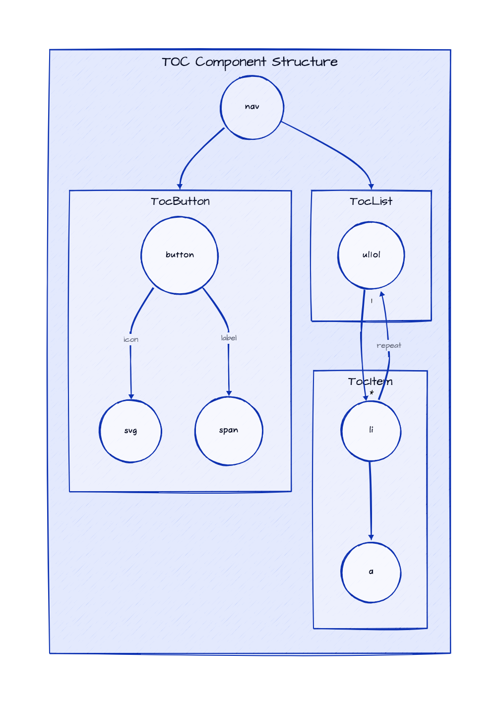

# TOC - Theming

To simplify custom styles on the component we used the built-in solution for component theming using [style-props].

The two component properties `styles` and `class` are the ones allowing you to customize the component appearence.

- `styles` is a JS object with the CSS variable name to override (without `--` prefix) as key and the value set to the allowed one for that CSS variable. This approach helps when you wish to tune few styles for the component.
- `class`: is a global CSS class name where the class content has the CSS variables to override. Using `class` is more suitable when the goal is to create personal versions(themes) for the component, so sevaral props are override;

> Refer to the [Design Rules] document to better understand how the component has been designed and how to customize the styles.

## DOM Element Structure

Below is the DOM Element Structure for the `Card` component.

> Legend
>
> - containers: Svelte components
> - circles: HTML elements



## Info Mapping Table

The DOM Element Structure above can be mapped to the following table going through the structure from top to bottom and from left to right.

| Component | HTML Elem | CSS Class Name | CSS Variables Prefix |
| :-------- | --------: | -------------: | -------------------: |
|           | `div`     | `sn-e-c-toc`   |                      |
| TocButton |           | `btn`          | `btn`                |
| TocList   |           | `list`         | `list`               |
| TocItem   |           | `list__item`   | `item`               |

## CSS Variables

The CSS variables are defined in the [variables.css](../../styles/components/toc/variables.css) file.

## Examples

### Custom Styles


```css
/* app.css */
.toc-violet-theme {
  --text-transform: uppercase;
  --bg-color: #7c3aed; /* violet-600 */
  --border-width: 2px;
  --border-style: dashed;
  --border-color: #c084fc; /* violet-400 */
  --border-radius: 0px;
  /* btn */
  --btn-color: white;
  --btn-bg-color: none;
  --btn-bg-color-hover: #5b21b6; /* violet-800 */
  --btn-pt: 0.375rem; /* 6px */
  --btn-pr: 0.625rem; /* 8px */
  --btn-pb: 0.375rem; /* 6px */
  --btn-pl: 0.625rem; /* 8px */
  /* list */
  --list-style-type: none;
  --list-width: var(--list-width, 100%);
  --list-bg-color-hover: #c4b5fd; /* violet-300 */
  --list-pt: 10px;
  --list-pr: 0;
  --list-pb: 0;
  --list-pl: 20px;
  /* item */
  --item-color: white; /* slate-700 */
  --item-text-decoration: none;
  --item-text-decoration-hov: none;
  --item-bg-color-hover: rgb(226, 232, 240); /* slate-200 */
  --item-pt: 0.25rem;
  --item-pr: 0.25rem;
  --item-pb: 0.25rem;
  --item-pl: 0.25rem;
}
```

```html
<script>
    import { TOC } from '@sveltinio/widgets/toc';
</script>

<TOC data={tocEntries} class="toc-violet-theme" prefixChar="*" />
```

<!-- Resources -->
[style-props]: https://svelte.dev/docs#template-syntax-component-directives---style-props
[Design Rules]: https://github.com/sveltinio/components-library/blob/main/docs/design-rules.md
